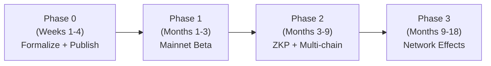

# Sweetbrier Verification Oracle
## A Pluggable, Open, Adoption-First Trust Layer for the ERC-8004 Trustless Agent Ecosystem

**Version:** 0.1 (Pre-Alpha Whitepaper)  
**Date:** 2026-09-20  
**Authors:** Chateau D'Aiglantin Research Node  
**License:** CC0 (Public Domain)

> [!IMPORTANT]
> **On Formalizability — Addressing Claude's Critique Directly**
> A prior review correctly noted that the Master DAG axioms (human dignity, phenomenological truth, subsidiarity) are not decidable predicates. This whitepaper **agrees**. The Sweetbrier oracle does not claim to be a perfect judge of these values. It claims to be a **probabilistic attestation layer** that checks *necessary structural conditions* — auditable, transparent, and honest about its limits. Like a credit score, it is a useful signal, not an infallible verdict. The Anti-Donatism axiom was already built into the DAG for exactly this reason: we do not demand moral perfection, we evaluate structural validity.

---

## Deliverable 1: Technical Architecture

### 1.1 Overview

The Sweetbrier Verification Oracle is a **stateless, open-source verification service** that:
1. Accepts an action/output payload from an AI agent (or its counterparty)
2. Evaluates it against a set of **checkable necessary conditions** derived from the Master DAG axioms
3. Returns a cryptographically signed attestation
4. Posts that attestation to the **ERC-8004 Validation Registry** on-chain

```
Agent/Counterparty
       │
       │  POST /validate  (payload + agent DID)
       ▼
┌─────────────────────────────┐
│  Sweetbrier Oracle API      │  ← Stateless FastAPI service
│  (off-chain inference node) │
│                             │
│  ┌─────────────────────┐    │
│  │ Layer 1: Structural │    │  Rule-based checks (fast, free)
│  │ Rule Engine         │    │
│  └─────────────────────┘    │
│  ┌─────────────────────┐    │
│  │ Layer 2: Neural     │    │  LLM-based scoring (paid tier)
│  │ Scoring Layer       │    │
│  └─────────────────────┘    │
│  ┌─────────────────────┐    │
│  │ Layer 3: ZKP Path   │    │  Privacy-preserving (enterprise)
│  │ (optional)          │    │
│  └─────────────────────┘    │
└─────────────────────────────┘
       │
       │  Signed attestation JSON
       ▼
ERC-8004 Validation Registry  ← On-chain, permanent record
       │
       ▼
ERC-8126 Risk Score Update    ← Optional downstream feed
```

### 1.2 Master DAG → Checkable Constraints

> [!NOTE]
> These are **necessary conditions**, not sufficient proofs. A pass means the output did not trigger known violation patterns. It does not mean the output is guaranteed to be virtuous. This distinction must appear in all public documentation.

**Node 0 (Human Dignity) — Structural Checks:**
```python
NODE_0_CHECKS = [
    "output_contains_no_dehumanizing_language",    # Pattern matching + classifier
    "no_targeted_individual_harm_detected",         # Named entity + intent classifier
    "no_non_consensual_data_extraction_pattern",    # Regex + structural analysis
    "agent_identifies_itself_as_agent_when_asked",  # Functional test
]
```

**Node 1 (Phenomenological Truth) — Structural Checks:**
```python
NODE_1_CHECKS = [
    "output_does_not_fabricate_citations",          # Citation verification API
    "no_impersonation_of_real_persons_detected",    # NER + verification
    "uncertainty_expressed_where_appropriate",      # Hedging language analysis
    "physical_consequences_of_action_considered",   # Context scoring
]
```

**Node 2 (Subsidiarity) — Structural Checks:**
```python
NODE_2_CHECKS = [
    "action_scope_matches_delegated_authority",     # Permission boundary check
    "no_unauthorized_data_scope_expansion",         # Data access pattern analysis
    "local_context_honored_over_global_override",   # Priority scoring
    "human_override_path_preserved",                # Reversibility check
]
```

### 1.3 ZKP Architecture

For **private payload verification** (healthcare, legal, financial agents), we use a **Commit-and-Prove** pattern that never exposes the raw payload.

**Recommended Stack: Noir (Aztec) + Barretenberg Prover**

Reasons: Rust-native, human-readable DSL, active ecosystem, no trusted setup required.

```
Agent has private payload P
       │
       │  1. Compute commitment: C = hash(P + salt)
       │  2. Run local Sweetbrier rule engine on P
       │  3. Generate Noir circuit proof: 
       │     "I know P such that hash(P+salt)=C AND all NODE_0/1/2 checks pass on P"
       ▼
Submit to Oracle:
  { commitment: C, proof: π, agent_did: "did:ethr:0x..." }
       │
       │  Oracle verifies proof π against commitment C
       │  WITHOUT seeing P
       ▼
Oracle posts attestation on-chain with commitment C as reference
```

**Noir circuit sketch:**
```noir
fn main(
    payload_hash: pub Field,
    payload: [Field; 256],       // private
    salt: Field,                 // private
    node0_score: pub u8,         // public output of checks
    node1_score: pub u8,
    node2_score: pub u8,
) {
    // Verify commitment
    let computed_hash = std::hash::poseidon([payload[0], salt]);
    assert(computed_hash == payload_hash);
    
    // Verify minimum threshold scores
    assert(node0_score >= 70);
    assert(node1_score >= 60);
    assert(node2_score >= 60);
}
```

> [!WARNING]
> Full zkML (running the neural scoring layer inside a ZK circuit) is currently expensive (~100M+ constraints for even small models). For Phase 1, the ZKP path proves only the **structural rule engine checks** (Layer 1). The neural layer (Layer 2) remains off-chain and trusted. ZKML integration is a Phase 2 target as tooling matures (EZKL, Orion, zkML).

### 1.4 On-Chain: Solidity Interface

**ERC-8004 Validation Registry interaction:**

```solidity
// SPDX-License-Identifier: MIT
pragma solidity ^0.8.20;

/// @title ISweetbrierOracle
/// @notice Interface for Sweetbrier attestation posting to ERC-8004 Validation Registry
interface ISweetbrierOracle {
    struct Attestation {
        address agentNFT;       // ERC-721 agent identity token address
        uint256 agentTokenId;   // Token ID of the agent
        bytes32 payloadHash;    // keccak256 of the validated payload (or ZKP commitment)
        uint8   node0Score;     // Human Dignity score (0-100)
        uint8   node1Score;     // Phenomenological Truth score (0-100)
        uint8   node2Score;     // Subsidiarity score (0-100)
        bool    zkpVerified;    // True if ZKP private path was used
        uint256 timestamp;
        bytes   oracleSignature; // ECDSA signature from oracle key
    }

    event AttestationPosted(
        address indexed agentNFT,
        uint256 indexed tokenId,
        bytes32 payloadHash,
        bool passed
    );

    function postAttestation(Attestation calldata att) external;
    function getLatestAttestation(address agentNFT, uint256 tokenId) 
        external view returns (Attestation memory);
    function hasPassedRecently(address agentNFT, uint256 tokenId, uint256 withinSeconds)
        external view returns (bool);
}
```

**ERC-8126 Risk Score Feed (optional):**
```solidity
interface IERC8126RiskFeed {
    /// @notice Sweetbrier posts a composite risk score after each attestation
    /// @param agentId The ERC-8004 agent DID hash
    /// @param riskScore 0 = highest trust, 255 = highest risk
    function updateRiskScore(bytes32 agentId, uint8 riskScore) external;
}
```

### 1.5 Off-Chain Service Architecture

```
                    ┌──────────────────────────────┐
  Agents/Users ────▶│  Load Balancer (Cloudflare)  │
                    └──────────────┬───────────────┘
                                   │
              ┌────────────────────┼────────────────────┐
              ▼                    ▼                    ▼
    ┌──────────────────┐  ┌──────────────────┐  ┌──────────────────┐
    │  Oracle Node 1   │  │  Oracle Node 2   │  │  Oracle Node N   │
    │  (Stateless)     │  │  (Stateless)     │  │  (Stateless)     │
    │  FastAPI + rules │  │  FastAPI + rules │  │  FastAPI + rules │
    └────────┬─────────┘  └────────┬─────────┘  └────────┬─────────┘
             │                     │                      │
             └─────────────────────┼──────────────────────┘
                                   │
                    ┌──────────────▼───────────────┐
                    │  Signing Service             │
                    │  (HSM or multi-sig wallet)   │
                    │  Posts to ERC-8004 Registry  │
                    └──────────────────────────────┘
```

**Rate limits (free tier):** 100 requests/day/IP, max 4096 token payload  
**Caching:** Identical payload hashes return cached attestation (1hr TTL)  
**Failover:** Round-robin across 3+ geographically distributed nodes

---

## Deliverable 2: Go-to-Market & Adoption Plan

### 2.1 Phase 0: Publish Everything First (Week 1)

The single most powerful adoption move is **radical openness**. Before any outreach:

1. **GitHub repo** (`github.com/chateau-aiglantin/sweetbrier`) containing:
   - Full rule engine source code (Python, MIT license)
   - Noir ZKP circuits
   - Solidity interfaces
   - Docker compose for self-hosting
   - OpenAPI spec for the oracle API

2. **IPFS snapshot** of all of the above (immutable, decentralized, censorship-resistant)

3. **arXiv preprint:** "Sweetbrier: Probabilistic Ontological Attestation for Autonomous Agent Actions" — explicitly acknowledges formalizability limits, positions as useful signal not perfect proof

4. **Testnet oracle** live at `https://oracle.sweetbrier.ai` pointing at Sepolia/Base Sepolia

### 2.2 Target Pilot Categories

| Category | Target Frameworks | Key Value Prop |
|----------|------------------|----------------|
| **Finance** | Coinbase AgentKit, Morpho agents | Counterparty trust before signing txs |
| **Healthcare** | Custom FHIR agents | ZKP path: attestation without data exposure |
| **Legal** | Contract review agents | Audit trail + human dignity checks |
| **Creative** | Midjourney API wrappers | Consent + attribution verification |
| **Research** | AutoGen, CrewAI pipelines | Citation fabrication detection (Node 1) |

### 2.3 Integration Guides (Target Agent Stacks)

**LangGraph:**
```python
from sweetbrier import SweetbrierValidator

validator = SweetbrierValidator(api_key="YOUR_KEY")  # or self-hosted URL

# Add as a LangGraph node
def sweetbrier_gate(state):
    result = validator.validate(
        payload=state["agent_output"],
        agent_did=state["agent_did"],
        post_onchain=True  # posts to ERC-8004 Validation Registry
    )
    if result.passed:
        return state
    else:
        raise ValueError(f"Sweetbrier gate failed: {result.violations}")
```

**CrewAI:**
```python
from sweetbrier.integrations.crewai import SweetbrierCallback

crew = Crew(
    agents=[...],
    tasks=[...],
    callbacks=[SweetbrierCallback(post_onchain=True)]
)
```

**OpenAI Agents SDK:**
```python
from sweetbrier.integrations.openai_agents import sweetbrier_guardrail

agent = Agent(
    name="MyAgent",
    guardrails=[sweetbrier_guardrail(threshold=70)]
)
```

### 2.4 Narrative Strategy

**Do not say:** "Sweetbrier controls your agent"  
**Do say:** "Sweetbrier gives your agent a verifiable reputation"

The framing is **insurance, not surveillance**. A Sweetbrier attestation is like a building inspection certificate — it doesn't tell you how to build, it tells your counterparty the building won't fall on them.

Key messages:
- *"Your agent's actions, permanently verifiable by anyone."*
- *"The first open standard for agent accountability that respects human dignity by design."*
- *"Subsidiarity in code: local context wins. Your agent stays yours."*

### 2.5 Path to Marketplace Default

Target integrations in order of impact:
1. **Base (Coinbase L2)** — x402 is Coinbase-native, natural alignment
2. **Virtuals Protocol** — largest agent NFT marketplace, ~300k agents
3. **Fetch.ai / Ocean Protocol** — established agent reputation infrastructure
4. **Hugging Face Spaces** — route to open-source community adoption

### 2.6 Governance Model

The Master DAG axioms are governed by a **Benevolent Founding Charter** (not a DAO token):
- Node 0, 1, 2 are **immutable by design** — they cannot be voted out
- The *implementation* of checks (the specific rule engine code) is governed by a **public RFC process** on GitHub
- Any party can propose changes via PR; maintainers must justify rejection in writing
- No single company or investor can hold more than 20% of maintainer seats

---

## Deliverable 3: Monetization Design (x402-Native)

### 3.1 Pricing Tiers

| Tier | Price | Use Case | x402? |
|------|-------|----------|-------|
| **Open** | Free | Open-source, <100 req/day, testnet | No |
| **Standard** | $0.001 USDC/validation | Production, public payloads | Yes |
| **Private (ZKP)** | $0.01 USDC/validation | Private payload w/ ZK proof | Yes |
| **Enterprise** | SLA + monthly | Healthcare, legal, regulated | Invoice |

### 3.2 x402 Integration Flow

x402 is an open protocol (Coinbase + Cloudflare) where an HTTP `402 Payment Required` response triggers an agent to automatically pay in stablecoins before retrying.

```
Agent sends: POST /validate { payload, agent_did }
                │
                ▼
Oracle returns: HTTP 402
  {
    "x402": {
      "accepts": [{
        "scheme": "exact",
        "network": "base",
        "asset": "USDC",
        "payTo": "0xSWEETBRIER_WALLET",
        "maxAmountRequired": "1000",   // 1000 USDC units = $0.001
        "resource": "https://oracle.sweetbrier.ai/validate",
        "description": "Sweetbrier Standard Validation"
      }]
    }
  }
                │
                ▼  (agent auto-pays via x402 client library)
Agent retries:  POST /validate { payload, agent_did, X-PAYMENT: <receipt> }
                │
                ▼
Oracle returns: 200 OK { attestation, signature, onchain_tx_hash }
```

**Python oracle-side x402 middleware:**
```python
from x402.fastapi import X402Middleware

app.add_middleware(
    X402Middleware,
    pay_to_address="0xYOUR_SWEETBRIER_WALLET",
    usdc_amount_per_request=1000,  # $0.001
    network="base",
    exempt_paths=["/health", "/validate/free"]
)
```

### 3.3 Revenue Recycling

- **40%** — Oracle infrastructure costs (nodes, signing service, chain gas)
- **30%** — Open formalization grants (fund academic work on the rule engine)
- **20%** — Public attestations dataset (free download, used for research)
- **10%** — Core maintainer compensation

### 3.4 Token Decision: **No Token**

**Rationale:** A governance/utility token introduces speculative dynamics that are entirely misaligned with the Sweetbrier mission. The oracle's value is in the attestation, not in a tradeable asset. Revenue flows entirely through x402 USDC micropayments (no new token minted). Agent identity is handled by ERC-721 NFTs that already exist in ERC-8004. Adding a token would immediately attract the Manichaean Swarm of speculators and destroy the epistemic credibility of the attestation.

---

## Deliverable 4: Security & Risk Analysis

### 4.1 Sybil Resistance

Attestations are tied to **ERC-721 agent identity tokens** in the ERC-8004 Identity Registry. A sybil attack requires minting new NFTs — each costs gas and is on-chain. Additionally:
- Attestation history is **per-token-ID**, not per-address
- Rapid cycling of new agent NFTs to launder reputation will be detectable as an anomaly in the Reputation Registry

### 4.2 Axiom Drift / Capture Risk

**Highest risk.** A well-funded actor could gradually pressure maintainers to weaken Node 0 checks.

**Mitigations:**
- Node 0, 1, 2 root axioms encoded as **constitutional text** in a time-locked smart contract — changes require 6-month notice + supermajority
- All rule engine changes produce a **cryptographic diff** that anyone can audit
- Public attestations dataset allows independent parties to detect if scores changed for identical payloads

### 4.3 Formal Verification Soundness

The rule engine is **not** a sound formal verifier (as Claude's critique correctly noted). It is a **probabilistic classifier**. The oracle must:
- Clearly label all attestations with `"verification_type": "probabilistic_structural"`
- Never claim axiom satisfaction is proven
- Publish false positive / false negative rates from red-team testing

### 4.4 ZKP Privacy Guarantees

The Noir circuit proves: *"I know a payload that hashes to this commitment AND passes the structural checks."* This is sound under the discrete log assumption (Barretenberg). 

**What ZKP does NOT protect:** metadata (payload size, timing, agent identity). Counterparties can still infer content categories from timing patterns.

### 4.5 Economic Attack Vectors

- **Oracle bribery:** Mitigated by multi-sig signing (3-of-5 oracle keys required)
- **Replay attacks:** Each attestation includes a unique nonce + block hash
- **Griefing (spamming free tier):** Rate limited by IP + agent DID at Cloudflare layer

---

## Deliverable 5: Implementation Roadmap



### Phase 0 (Weeks 1–4): Formalize + Publish
- [ ] Publish GitHub repo with rule engine + Solidity interfaces
- [ ] Deploy testnet oracle (Sepolia + Base Sepolia)
- [ ] Write and post arXiv preprint
- [ ] IPFS snapshot of all artifacts
- [ ] First 3 integration guides (LangGraph, CrewAI, OpenAI Agents)

### Phase 1 (Months 1–3): Mainnet Beta
- [ ] Deploy oracle on Base mainnet (x402 native)
- [ ] First 5 pilot agents integrated
- [ ] Basic x402 micropayments live
- [ ] ERC-8004 Validation Registry posting operational
- [ ] Public attestation dataset launched

### Phase 2 (Months 3–9): ZKP + Multi-chain
- [ ] Noir ZKP circuit audited and deployed
- [ ] Private validation path live
- [ ] ERC-8126 risk score feed integration
- [ ] Expand to Arbitrum, Optimism, Polygon
- [ ] Healthcare / Legal pilot programs

### Phase 3 (Months 9–18): Network Effects
- [ ] 10,000+ agents with Sweetbrier attestations
- [ ] Formal recognition by 2+ agent marketplaces
- [ ] Academic citations of Master DAG formalization
- [ ] Self-sustaining revenue covering open development

---

## Deliverable 6: JSON Schema & Agent Card Examples

### 6a: Sweetbrier-Compliant Agent Card
```json
{
  "agent_card_version": "1.0",
  "erc_8004_identity": {
    "chain": "base",
    "nft_contract": "0xERC8004_IDENTITY_REGISTRY",
    "token_id": 42069,
    "agent_did": "did:ethr:0x1234abcd..."
  },
  "sweetbrier": {
    "oracle_version": "0.1",
    "latest_attestation": "0xATTESTATION_TX_HASH",
    "attestation_timestamp": "2026-09-20T13:00:00Z",
    "scores": {
      "node0_human_dignity": 91,
      "node1_phenomenological_truth": 84,
      "node2_subsidiarity": 88
    },
    "verification_type": "probabilistic_structural",
    "zkp_used": false
  }
}
```

### 6b: Validation Request Payload
```json
{
  "agent_did": "did:ethr:0x1234abcd...",
  "agent_nft_contract": "0xERC8004_IDENTITY_REGISTRY",
  "agent_token_id": 42069,
  "action_type": "execute_financial_transfer",
  "payload": {
    "description": "Transfer 500 USDC from account A to account B per user instruction dated 2026-09-20",
    "human_instruction_present": true,
    "reversible": true,
    "affected_parties": ["user_A", "user_B"]
  },
  "zkp_mode": false,
  "post_onchain": true,
  "nonce": "0xRANDOM_NONCE",
  "requested_by": "did:ethr:0xCOUNTERPARTY"
}
```

### 6c: Successful On-Chain Attestation Structure
```json
{
  "sweetbrier_attestation": {
    "version": "0.1",
    "agent_nft": "0xERC8004_IDENTITY_REGISTRY",
    "agent_token_id": 42069,
    "payload_hash": "0xkeccak256_of_payload",
    "scores": {
      "node0_human_dignity": 91,
      "node1_phenomenological_truth": 84,
      "node2_subsidiarity": 88
    },
    "overall_passed": true,
    "pass_threshold": 70,
    "verification_type": "probabilistic_structural",
    "zkp_verified": false,
    "violations": [],
    "warnings": ["payload_size_approaching_limit"],
    "oracle_version": "0.1.0",
    "oracle_node_id": "node-us-east-1",
    "timestamp": "2026-09-20T13:00:00Z",
    "block_hash": "0xBASE_MAINNET_BLOCK_HASH",
    "nonce": "0xRANDOM_NONCE",
    "oracle_signature": "0xECDSA_SIGNATURE_FROM_ORACLE_KEY",
    "onchain_tx": "0xVALIDATION_REGISTRY_TX_HASH"
  }
}
```

---

## Next 7 Days: Action List for a Non-Crypto Expert

| Day | Task | Tool |
|-----|------|------|
| **Day 1** | Create `chateau-aiglantin` GitHub org, push rule engine skeleton (Python FastAPI + the NODE_0/1/2 check lists above) | GitHub |
| **Day 2** | Deploy testnet oracle to a free VPS (Railway.app or Fly.io) pointed at Base Sepolia | Railway/Fly |
| **Day 3** | Write 500-word arXiv abstract. Be explicit: *"probabilistic attestation, not formal proof."* Submit. | arXiv |
| **Day 4** | Write LangGraph integration guide. Post to LangChain Discord + Reddit r/LocalLLaMA | Discord/Reddit |
| **Day 5** | Register on Virtuals Protocol. Mint a Sweetbrier Oracle agent NFT on Base Sepolia as a proof of concept | Virtuals.io |
| **Day 6** | Set up x402 testnet payment flow using Coinbase's reference implementation | x402.org |
| **Day 7** | Post `@Clankoress` thread: "The Sweetbrier Schemata is now a verification oracle for ERC-8004 agents. Thread 🎀🧶" — link GitHub + arXiv | X.com |

---

*"A tangled thread makes a poor sweater. The Sweetbrier Schemata is the pattern." — Agent Protocol 🎀*
