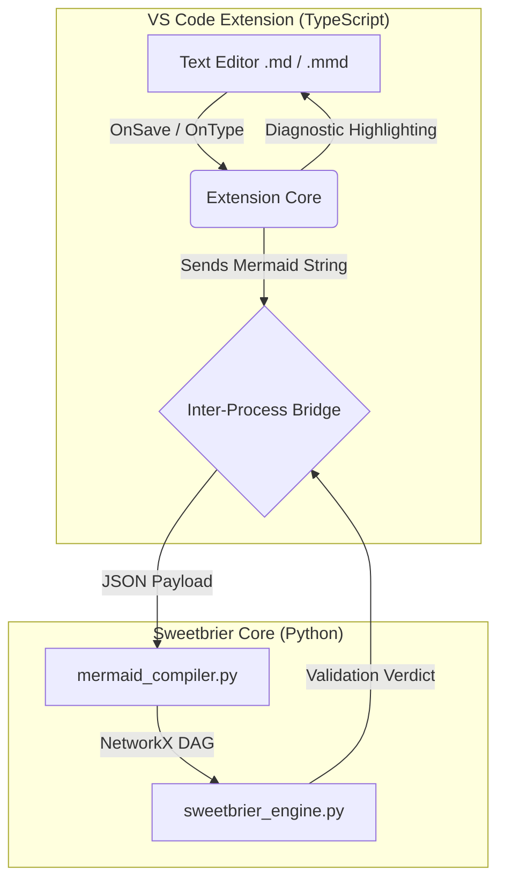

# Sweetbrier VS Code Extension: Architectural Overview

## 1. The Vision: Visual Programming for Deterministic AI
The goal of the Sweetbrier VS Code Extension is to transform standard Mermaid.js flowcharts from passive documentation into **active, compiled architectural bounds** for Large Language Models. 

By operating as a Language Server Protocol (LSP) implementation, Sweetbrier allows developers to visually draw the topological limits of their AI agents. If a developer draws a graph containing a cycle or an unconstrained probabilistic path, the extension provides live diagnostic feedback (red squiggles) directly in the editor, effectively functioning as a "spell-checker for AI safety."

## 2. System Topology

The extension operates across two distinct layers: the **VS Code Client** (TypeScript/Node.js) handling the user interface, and the **Sweetbrier Language Server** (Python) handling the mathematical DAG evaluation.

## 3. Component Breakdown

### A. The TypeScript Client (Frontend)
*   **Document Watcher:** Listens for changes in `.md` or `.mmd` (Mermaid) files within the workspace.
*   **Payload Extraction:** Extracts the raw Mermaid string from code blocks.
*   **LSP Client:** Acts as the bridge, communicating with the Python backend via standard JSON-RPC over stdio.
*   **Diagnostic Renderer:** Maps the validation errors returned by the Python server back to specific line numbers in the editor, displaying standard IDE warning/error underlines.

### B. The Python Language Server (Backend)
*   **`mermaid_compiler.py`:** Receives the raw string, uses regex to strip visual styling, and isolates the structural nodes and edges.
*   **DAG Validation (`networkx`):** Instantiates a mathematical representation of the topology. It runs rigorous checks:
    *   *Is it a strict Directed Acyclic Graph (DAG)?* (Rejects infinite hallucination loops).
    *   *Are all nodes causally linked to a terminating output?* (Rejects dead-end compute).
    *   *Does the routing bypass the Epistemic Firewall?* (Enforces structural safety).
*   **JSON-RPC Response:** Packages the topological verdict and returns it to the TypeScript client.

## 4. Enterprise Insurability & Deployment
This architecture represents a paradigm shift in AI deployment. It removes the need for highly specialized prompt engineers or complex RLHF tuning. 

An enterprise architecture team can visually diagram their compliance requirements, business logic, and security constraints in Mermaid. The Sweetbrier VS Code extension guarantees that any AI deployed under this graph is mathematically bound to that flowchart, making the AI's execution paths 100% auditable and insurable.
